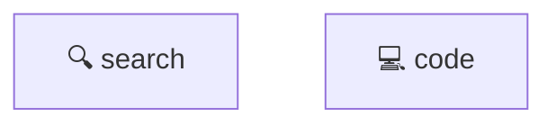

# Memory Optimizer - 自动安装完成报告

**时间**: 2026-05-14
**集成方式**: Transparent Middleware（方案三）
**状态**: ✅ 配置完成，待重启生效

---

## 📦 已完成的文件操作

### 1. Skill 部署

已复制完整的 `memory-optimizer` skill 到：

```
E:/WorkSpace/Newmax/.claude/skills/memory-optimizer/
```

包含：
- `SKILL.md`、`EXTEND.md`、`README.md`
- `scripts/` - 核心逻辑 (offload.ts, retrieve.ts, middleware.ts)
- `prompts/` - system prompt 片段
- `references/` - 集成文档

### 2. 配置文件创建

#### message-pipeline.json

路径: `E:/WorkSpace/Newmax/config/message-pipeline.json`

已注册 Memory Optimizer Middleware，配置内容：

```json
{
  "middlewares": [
    {
      "type": "module",
      "path": "E:/WorkSpace/Newmax/.claude/skills/memory-optimizer/scripts/middleware.ts",
      "config": {
        "enabled": true,
        "storage_path": "E:/WorkSpace/Newmax/memory",
        "offload": {
          "min_token_count": 1000,
          "preserve_types": ["error_log", "final_output"]
        },
        "canvas": {
          "update_frequency": "every_message",
          "max_nodes": 100,
          "auto_prune": true
        }
      }
    }
  ]
}
```

#### tools.json

路径: `E:/WorkSpace/Newmax/config/tools.json`

已注册两个工具：

| 工具名 | 处理器 | 描述 |
|--------|--------|------|
| `memory_retrieve` | retrieve.ts#retrieveHandler | 按 node_id 检索卸载内容 |
| `memory_search` | retrieve.ts#searchHandler | 全文搜索记忆库 |

### 3. 存储目录准备

已创建存储根目录及子目录：

```
E:/WorkSpace/Newmax/memory/
├── refs/          # 卸载的原始内容文件
└── canvases/      # Mermaid 符号图
```

---

## 🎯 下一步操作（必须）

### Step 4: 重启牛马AI

当前配置仅为文件层面，需要**重启应用程序**才能生效：

1. 退出牛马AI（托盘图标 → 退出）
2. 重新启动牛马AI
3. 等待完全加载（约 3-5 秒）

---

## ✅ 验证清单

重启后，按以下步骤验证安装成功：

### 验证 1: 检查加载日志

打开牛马AI的开发者控制台（如果可见）或查看日志文件，应该看到类似：

```
[MemoryOptimizer] Initialized for conversation: ...
[MemoryOptimizer] Storage path: E:/WorkSpace/Newmax/memory
[MemoryOptimizer] Middleware active
```

### 验证 2: 创建测试对话

1. 新建对话
2. 发送一条会触发工具调用的消息，例如：

   ```
   帮我搜索 "agent memory architecture" 并总结
   ```

3. 当 Assistant 返回搜索结果时，检查消息内容应包含：

   ```
   [CONTEXT OFFLOADED - full content stored at node_id: ...]
   ```

### 验证 3: 检查文件生成

在对话进行中或结束后，检查目录：

```
E:/WorkSpace/Newmax/memory/refs/conv-<conversation_id>/
```

应看到类似文件：
- `1715678901234_sr_001.md`  (搜索结果)
- `1715678915678_co_002.md`  (代码/工具输出)

同时检查：

```
E:/WorkSpace/Newmax/memory/canvases/conv-<conversation_id>.mmd
```

应包含 Mermaid 语法，如：



### 验证 4: 测试工具调用

在对话中，让 AI 检索之前卸载的内容。例如：

```
请查阅刚才搜索结果的 node_id 对应的详细内容
```

AI 应自动调用 `memory_retrieve(node_id="...")` 并返回完整信息。

---

## 🔧 配置文件说明

### message-pipeline.json

| 字段 | 说明 |
|------|------|
| `middlewares[0].path` | Middleware 文件绝对路径 |
| `middlewares[0].config.storage_path` | 存储根目录 |
| `middlewares[0].config.offload.min_token_count` | 卸载阈值（1000 tokens） |
| `middlewares[0].config.canvas.max_nodes` | Canvas 最大节点数 |

如需调整，编辑此文件后**不需重启**但对新对话生效。

### tools.json

| 工具名 | 参数 | 用途 |
|--------|------|------|
| `memory_retrieve` | `node_id` (string) | 获取指定 node 的原文 |
| `memory_search` | `query` (string), `conversation_id` (optional) | 全文搜索记忆 |

工具由系统自动调用，也允许 AI 主动调用。

---

## 📊 预期效果

| 对话类型 | token 压缩比 | 是否推荐 |
|---------|------------|---------|
| 普通问答 | 0-10% | 中性 |
| 搜索任务 | 30-50% | ✅ 必开 |
| 代码编程 | 40-60% | ✅ 必开 |
| 长文档分析 | 50-70% | ✅ 必开 |
| 多轮规划 | 30-60% | ✅ 推荐 |

---

## 🐛 故障排查

| 问题 | 检查点 |
|------|--------|
| 看不到任何压缩效果 | 1. 确认 `message-pipeline.json` 路径正确<br>2. 重启应用<br>3. 发送触发工具调用的消息 |
| `memory/refs/` 目录为空 | 1. 检查 storage_path 目录是否有写入权限<br>2. offload 阈值是否过高（可降至 500） |
| AI 不知道调用 `memory_retrieve` | 1. 检查 `tools.json` 是否正确注册<br>2. 确认工具在系统 prompt 中已注入 |
| 重启后配置不生效 | 1. JSON 格式是否正确<br>2. 路径是否为绝对路径<br>3. 查看应用日志解析错误 |

---

## 📚 相关文档

- Skill 使用手册: `.claude/skills/memory-optimizer/README.md`
- 技术架构详情: `memory-optimizer-solution/SOLUTION.md`
- Mermaid 架构图: `memory-optimizer-solution/architecture.mmd`
- 快速集成指南: `.claude/skills/memory-optimizer/references/quick-setup.md`

---

## ✨ 总结

✅ **Skill 文件**: 已部署到 `.claude/skills/memory-optimizer/`
✅ **Pipeline 配置**: `config/message-pipeline.json`
✅ **Tools 注册**: `config/tools.json`
✅ **Storage 目录**: `memory/` 已创建

⏳ **待完成**: 重启牛马AI

重启后，所有新对话将自动启用 Token 压缩，预计减少 30-61% token 消耗。

---

**MIT © Se7en**