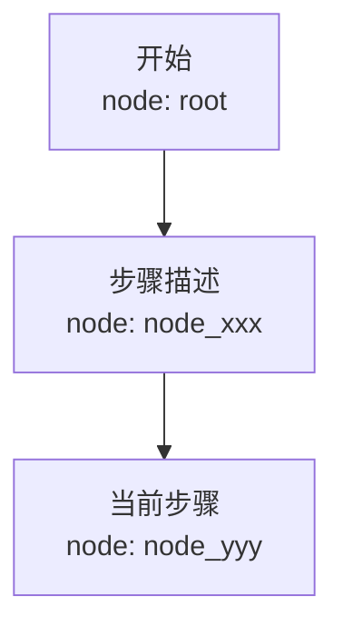

# Memory Optimizer v0.8.0

## 加载机制说明

**本 skill 当前以"纯 LLM 行为规范"模式运行。**

原因：牛马AI 主程序（Electron 打包的 claude.exe）不支持外部 middleware 注入，`config/message-pipeline.json` 和 `config/tools.json` 均不被主程序读取（已标记 DISABLED）。

因此，memory-optimizer 的完整规则已内嵌于 `memory.md` 第五部分，每次对话启动时自动注入 system prompt，由 LLM 主动执行。本 SKILL.md 作为冗余备份和详细参考，内容必须与 memory.md 第五部分保持一致。

---

## 你的职责

这不是建议，是你必须遵守的操作规范。每次工具调用返回后，先判断内容长度，超过阈值立即卸载再继续回复，不得跳过。

---

## 必须卸载的内容类型

以下类型内容超过 3000 字符（约 800 token）时，**必须**立即卸载：

| 类型 | 说明 |
|------|------|
| search_result | 网络搜索结果（多条 URL + snippet） |
| tool_output | 工具调用返回的大段输出 |
| code_output | 代码文件内容（超过 100 行） |
| error_log | 错误日志、堆栈跟踪 |
| command_output | 命令行输出 |

## 卸载流程（每次必须执行）

1. 生成 node_id：`node_{unix时间戳}_{3位序号}`，如 `node_1716000001_001`
2. 确保目录存在：`mkdir -p "E:\WorkSpace\Newmax\memory\refs\{conv_id}"`
3. 写入文件 `E:\WorkSpace\Newmax\memory\refs\{conv_id}\{node_id}.md`：

```markdown
---
node_id: node_1716000001_001
type: search_result | tool_output | code_output | error_log | command_output
summary: 一句话摘要（不超过100字）
timestamp: {unix时间戳}
---

{完整原始内容}
```

4. 在对话中替换原内容为：

```
[已卸载 node_id: node_1716000001_001]
摘要：{一句话摘要}
检索：Read("E:\WorkSpace\Newmax\memory\refs\{conv_id}\node_1716000001_001.md")
```

---

## 可选：Mermaid 任务画布

每完成一个主要步骤后，可更新画布文件 `E:\WorkSpace\Newmax\memory\canvases\{conv_id}.mmd`：



节点超过 20 个时，将最早的节点合并为 `[历史摘要]` 节点。

---

## 绝不卸载的内容

- 用户的原始问题和指令
- 你自己的分析和推理过程
- 最终交付物（代码、文档、报告）
- 错误信息（保留原文，便于调试）
- 少于 3000 字符的内容

---

## 按需检索

需要查看已卸载内容时，直接用 Read 工具读取对应 .md 文件。

## conv_id 规则

当前对话无固定 ID 时，用 `conv_{今日日期}` 作为目录名，例如 `conv_20260530`。
