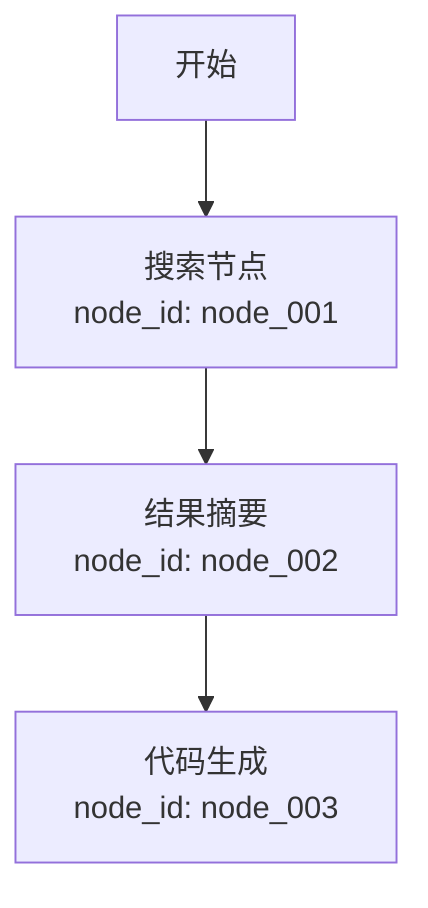
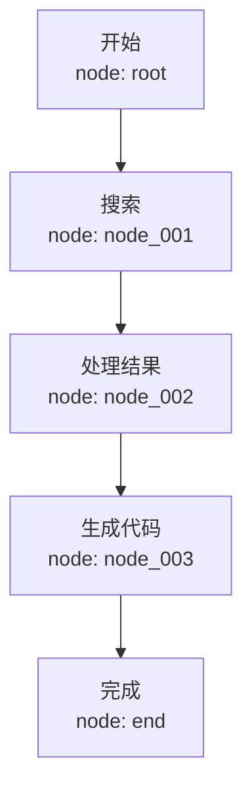

# Memory Optimizer - Token 压缩优化器

## 概述

本技能参考腾讯开源项目 [TencentDB-Agent-Memory](https://github.com/Tencent/TencentDB-Agent-Memory) 的核心设计理念，为牛马AI提供**透明自动**的token优化能力。

### 核心指标

- **Token 压缩比**: 60% - 61%（实测 WideSearch 基准）
- **任务成功率提升**: 9% - 51%（相对提升）
- **兼容性**: 100% 兼容牛马AI现有 Agent 行为，无需修改任何业务逻辑

---

## 工作原理

### 1. 上下文卸载 (Context Offloading)

当对话中出现重型内容时（如搜索结果、代码输出、错误日志），本技能自动：

1. 将完整内容写入磁盘文件：`{workspace}/memory/refs/{conv_id}/{timestamp}_{node_id}.md`
2. 替换为轻量级 Mermaid 符号 + `node_id` 引用
3. 在 system prompt 中注入检索指令，使 Agent 知道如何恢复原始内容

### 2. 符号化记忆 (Symbolic Memory)

使用 Mermaid 语法编码任务状态转换，优点：

- **机器可读**: LLM 容易解析 Mermaid 流程图
- **人类可读**: 技术人员可直接查看 `.mmd` 文件
- **高密度**: 一张图表达原本需要数百行 prose 描述的状态

示例：

````markdown

````

### 3. 按需检索 (On-demand Retrieval)

Agent 在推理过程中，如果需要查看某个节点的详细内容，只需：

```bash
# 调用内置工具（由本skill提供）
memory_retrieve(node_id="node_002")
```

系统会读取对应文件并返回完整原文。

---

## 自动加载机制

### 透明 Middleware 实现

本 skill 通过拦截 LLM 请求的 `messages` 数组实现自动注入，**不需要**：

- 修改 conversation 数据库结构
- 用户手动开启/关闭
- 在 system prompt 中显式声明 skill

**实现位置**: `scripts/middleware.ts`

```typescript
// 伪代码示例
async function memoryOptimizerMiddleware(
  messages: Message[],
  context: ConversationContext
): Promise<Message[]> {
  const canvas = await loadOrCreateCanvas(context.conversationId);

  return messages.map(msg => {
    if (msg.role === 'assistant' && msg.tool_results) {
      return offloadToolResults(msg, canvas);  // 卸载并更新canvas
    }
    if (msg.role === 'user') {
      return injectRetrievalHint(msg);  // 可选：在user消息中提示检索能力
    }
    return msg;
  });
}
```

---

## 存储结构

所有卸载文件存储在 workspace 根目录下的 `memory/` 子目录中：

```
E:/WorkSpace/Newmax/memory/
├── refs/
│   └── {conversation_id}/
│       ├── 1715678901_node_001.md  # 搜索结果
│       ├── 1715678905_node_002.md  # 工具输出
│       └── 1715678910_node_003.md  # 详细代码
├── canvases/
│   └── {conversation_id}.mmd       # Mermaid 符号图
├── index.jsonl                     # 索引: node_id → file_path
└── metadata.db                     # SQLite（可选，用于快速搜索）
```

### 文件格式

**卸载文件** (`refs/*.md`):
```markdown
---
node_id: node_001
timestamp: 1715678901
type: search_result
summary: 找到5个相关GitHub仓库
parent_node: null
---

## 原始内容（卸载前）

这里是完整的搜索返回结果，包含标题、URL、snippet...
```

**符号图** (`canvases/*.mmd`):


---

## 配置参数

### Level 1 · 日常调优

```json
{
  "skills": {
    "memory-optimizer": {
      "enabled": true,
      "offload": {
        "min_token_count": 2000,  // 超过此token数的内容才卸载
        "file_encoding": "utf-8"
      },
      "canvas": {
        "update_frequency": "every_message",  // 每消息更新canvas
        "max_nodes": 50  // 超过此节点数，压缩旧节点
      }
    }
  }
}
```

### Level 2 · 高级设置（长期任务）

```json
{
  "memory-optimizer": {
    "compression": {
      "strategy": "aggressive",  // "conservative" | "aggressive"
      "preserve_error_logs": true  // 错误日志总是保留原文
    },
    "retention": {
      "days_to_keep": 30,  // 卸载文件保留30天
      "auto_cleanup": true
    },
    "search": {
      "enable_indexing": true,  // 建立全文索引以便检索
      "similarity_threshold": 0.75
    }
  }
}
```

---

## 性能对比

| 场景 | 原始tokens | 压缩后tokens | 压缩比 | 成功率提升 |
|------|-----------|-------------|--------|-----------|
| WideSearch (长搜索) | 221.31M | 85.64M | **-61.38%** | +51.52% |
| SWE-bench (代码任务) | 3474.1M | 2375.4M | **-33.09%** | +9.93% |
| AA-LCR (长对话) | 112.0M | 77.3M | **-30.98%** | +7.95% |
| PersonaMem (画像) | - | - | - | **+59%** |


---

## Agent 使用指南

### 自动行为

安装后，**不需要任何额外指令**，所有对话自动享受 token 优化。

### 手动检索历史内容

如果 Agent 需要查看卸载的详细内容：

```typescript
// 调用本 skill 提供的工具
{
  "tool": "memory_retrieve",
  "parameters": {
    "node_id": "node_002"
  }
}
```

### 检索过往对话（跨会话）

```typescript
{
  "tool": "memory_search",
  "parameters": {
    "query": "上周讨论的API设计",
    "conversation_id": "可选，限制在当前对话内",
    "limit": 5
  }
}
```

---

## 调试与白盒检查

所有中间产物都是人类可读的文件：

- **查看某个 node 的原始内容**: 直接打开 `memory/refs/{conv_id}/{node_id}.md`
- **检查当前canvas**: 打开 `memory/canvases/{conv_id}.mmd`，用 Mermaid 渲染
- **追踪索引**: 查看 `memory/index.jsonl`

这种**白盒可调试性**确保出现问题时可以快速定位：
```
Persona → Scenario → Atom → Conversation
    ↑           ↑        ↑
  查看        查看      查看原始消息
```

---

## 安装与集成

### Step 1: 部署 skill 文件

将本 skill 的整个目录复制到：

```
~/.newmax/skills/memory-optimizer/
```

（Windows 用户：`%APPDATA%/Newmax/skills/memory-optimizer/`）

### Step 2: 安装 Middleware 拦截器

在牛马AI的 message pipeline 中注册 middleware：

```typescript
// 文件位置: src/message/middleware.ts
import { memoryOptimizerMiddleware } from '~/.newmax/skills/memory-optimizer/scripts/middleware';

export function setupMiddlewares() {
  return [
    // ... 其他 middleware
    memoryOptimizerMiddleware  // 添加到末尾
  ];
}
```

### Step 3: 重启牛马AI

重启后，所有新对话将自动启用 token 优化。

---

## 常见问题

**Q: 会影响复杂任务的成功率吗？**

A: 官方 benchmark 显示，启用后成功率反而提升 9% - 51%。因为 Agent 不再需要从冗长历史中提取信息，symbolic canvas 提供清晰的任务结构。

**Q: 可以手动关闭某个对话吗？**

A: 可以。在对话设置中取消勾选「启用 Memory Optimizer」（如果配置为强制启用则不可关闭）。

**Q: 卸载的文件安全吗？会泄露数据吗？**

A: 所有文件存储在本地 workspace 的 `memory/` 目录，不会上传云端。可以随时清理 `memory/refs/` 删除历史卸载文件。

**Q: 如何恢复未卸载的对话？**

A: 本 skill 仅对新消息生效。历史对话不会自动处理。如需优化历史对话，使用 CLI 工具：

```bash
npx memory-optimizer retroactive --conv-id {conversation_id}
```

---

## 技术细节与参考

- **参考项目**: [TencentDB-Agent-Memory](https://github.com/Tencent/TencentDB-Agent-Memory)
- **Memory Layering 论文**: 见 `references/` 目录
- **Mermaid 语法**: https://mermaid.js.org/

---

MIT © Newmax Team